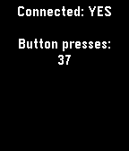

# smartstrap-button-counter

This is a smartstrap example project that displays how many times a button
attached to the connected smartstrap (here an Arduino Uno) has been pressed,
with a nominal 500ms de-bounce interval between presses.

To set up the button, create the same circuit as shown in the
[Arduino documentation](https://www.arduino.cc/en/Tutorial/Button), with the
sense pin connected to `BUTTON_PIN` (a default value of 7).